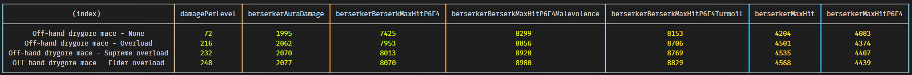

# Runescape 3 Ability damage Calculator

I tried to calculate the damage numbers for abilities.  

> This is a work in progress, and probably will not be finished.  
> But you can use this as a basis for your own calculators or whatever.

## Glossary

Word | Meaning
-----|--------
P6 | Precise perk at rank 6. Adds 1% per rank of ability max hit % to the min hit %. P6 adds 6%.
E4 | Equilibrium perk at rank 4. Adds 3% to minimum hit and subtracts 1% from maximum hit per rank. The 3% and 1% are based on the **damage range** of the ability, meaning `ability max - ability min`.

## Implementation details

* It handles overloads and prayers.  
* It handles Berserk and Berserker aura.
* It only does dual wield melee for now.  
* It assumes you perk with Precise 6 and Equilibrium 4.  

The actual "library" part is not done.  
Most of the ability damage calculation happens in `calculate.spec.ts`.  
(I intend to use `jest` to test, but I don't want to install anything right now. I don't even have a `node_modules` folder locally yet).

> The file `calculate.spec.ts` should probably be named `main.ts`, but I started here with my testing. 
> This was very explorative, as the calculations were not clear from the start.

To run the calculations, use `npm run build` (assuming you have `typescript` installed).  
Then run `node out/calculate.spec.js`.

## Example output

> The table probably looks very broken if you don't have a wide monitor.
> A picture is attacked at the bottom.

```text
$ node out/calculate.spec.js

Expected: 1960
Actual: 1960
	Main-hand: 2.5*99 + 864*1 + 196
	Off-hand: 1.25*99 + 432*1 + 0.5*196
Expected: 3577 
Actual: 3577
	Main-hand: 2.5*99 + 864*1 + 196
	Off-hand: 1.25*99 + 432*1 + 0.5*196
	Ability multiplier with P6E4 1.8254799999999998
Damage per level
	Expected:  5.1136 7.8688
	Actual:  5.1136 7.8688
--------
Damage with None (+0) : 1960
	Ability damage gets (P6E4) +0
	Max hit: 3684
	Max hit (P6E4): 3577
	Berserk max hit (P6E4): 7154
	Berserk Turmoil max hit (P6E4): 7869
	Berserk Malevolence max hit (P6E4): 8012
Damage with Overload (+17) : 2025
	Ability damage gets (P6E4) +136
	Max hit: 3943
	Max hit (P6E4): 3832
	Berserk max hit (P6E4): 7664
	Berserk Turmoil max hit (P6E4): 8430
	Berserk Malevolence max hit (P6E4): 8583
Damage with Supreme overload (+19) : 2032
	Ability damage gets (P6E4) +152
	Max hit: 3972
	Max hit (P6E4): 3861
	Berserk max hit (P6E4): 7722
	Berserk Turmoil max hit (P6E4): 8494
	Berserk Malevolence max hit (P6E4): 8648
Damage with Elder overload (+21) : 2040
	Ability damage gets (P6E4) +168
	Max hit: 4003
	Max hit (P6E4): 3891
	Berserk max hit (P6E4): 7782
	Berserk Turmoil max hit (P6E4): 8560
	Berserk Malevolence max hit (P6E4): 8715
--------
Off-hand: Off-hand drygore mace
Damage with Berserker aura and None (level 108) : 1995
	Ability damage gets +72
	Ability damage with P6E4 gets +70.8192
	Berserker Max hit: 4204
	Max hit (Eq4): 4083
	Berserker berserk max hit (Eq4): 7425
	Berserker berserk turmoil max hit (Eq4): 8153
	Berserker berserk malevolence max hit (Eq4): 8299
--------
Off-hand: Off-hand drygore mace
Damage with Berserker aura and Overload (level 126) : 2062
	Ability damage gets +216
	Ability damage with P6E4 gets +212.4576
	Berserker Max hit: 4501
	Max hit (Eq4): 4374
	Berserker berserk max hit (Eq4): 7953
	Berserker berserk turmoil max hit (Eq4): 8706
	Berserker berserk malevolence max hit (Eq4): 8856
--------
Off-hand: Off-hand drygore mace
Damage with Berserker aura and Supreme overload (level 128) : 2070
	Ability damage gets +232
	Ability damage with P6E4 gets +228.1952
	Berserker Max hit: 4535
	Max hit (Eq4): 4407
	Berserker berserk max hit (Eq4): 8013
	Berserker berserk turmoil max hit (Eq4): 8769
	Berserker berserk malevolence max hit (Eq4): 8920
--------
Off-hand: Off-hand drygore mace
Damage with Berserker aura and Elder overload (level 130) : 2077
	Ability damage gets +248
	Ability damage with P6E4 gets +243.9328
	Berserker Max hit: 4568
	Max hit (Eq4): 4439
	Berserker berserk max hit (Eq4): 8070
	Berserker berserk turmoil max hit (Eq4): 8829
	Berserker berserk malevolence max hit (Eq4): 8980
--------
┌──────────────────────────────────────────┬────────────────┬─────────────────────┬────────────────────────────┬───────────────────────────────────────┬───────────────────────────────────┬─────────────────┬─────────────────────┐
│                 (index)                  │ damagePerLevel │ berserkerAuraDamage │ berserkerBerserkMaxHitP6E4 │ berserkerBerserkMaxHitP6E4Malevolence │ berserkerBerserkMaxHitP6E4Turmoil │ berserkerMaxHit │ berserkerMaxHitP6E4 │
├──────────────────────────────────────────┼────────────────┼─────────────────────┼────────────────────────────┼───────────────────────────────────────┼───────────────────────────────────┼─────────────────┼─────────────────────┤
│       Off-hand drygore mace - None       │       72       │        1995         │            7425            │                 8299                  │               8153                │      4204       │        4083         │
│     Off-hand drygore mace - Overload     │      216       │        2062         │            7953            │                 8856                  │               8706                │      4501       │        4374         │
│ Off-hand drygore mace - Supreme overload │      232       │        2070         │            8013            │                 8920                  │               8769                │      4535       │        4407         │
│  Off-hand drygore mace - Elder overload  │      248       │        2077         │            8070            │                 8980                  │               8829                │      4568       │        4439         │
└──────────────────────────────────────────┴────────────────┴─────────────────────┴────────────────────────────┴───────────────────────────────────────┴───────────────────────────────────┴─────────────────┴─────────────────────┘

```



## Possible bugs

* Even if armour has decimal values (like my gear with `160.7` strength bonus), it seems the decimal is not used.
  * Alternatively, I have a bug in my code.
* Somewhere, some rounding/flooring might be missing. Or I use too many decimals (jagex seems to prefer 1 decimal). Some results are 1 off.
* `Most Worry mod: the overload range is affected by both precise and equil` ~~I have not verified overload bonus ability damage yet, caused by the supposed `8*levels`. It might be affected by P6E4. So far I only assumed it was affected by E4.~~
* Most abilities are 1:5 of min:max hit. Using this calculator with an ability that is not, will fail, unless P6E4 multiplier is re-calculated.
* `Most Worry mod: this is usually called "damage per level" and isn't unique to overloads. and yes berserk doubles that` ~~It is not clear from the wiki if the *ability damage boost* from overloads is doubled from `berserk` or +10% from `berserker aura`.~~
  * The ~~ability damage boost~~ *damage per level* is `8 * levels-above-your-actual-level`. Berserker aura makes you 9 levels up, and elder overload makes you 21 levels up.
